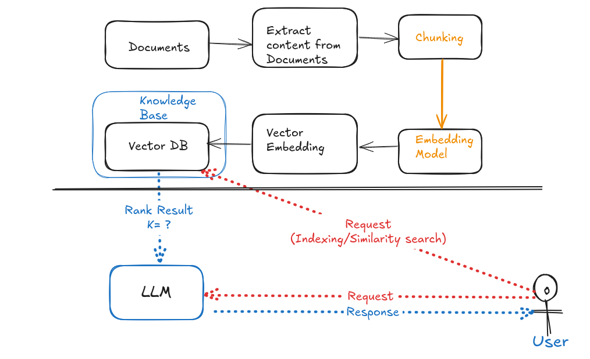

# medical-chatbot
The Medical Chatbot Project is an end-to-end RAG-based assistant that connects an LLM to a custom medical knowledge base. Built with LangChain, Pinecone, Hugging Face embeddings, and Flask, it delivers context-aware health insights. Deployed on AWS with CI/CD via GitHub Actions for real-world use.

## RAG Diagram



## Development Tools
- VS Code
- Git
- Anaconda

## Tech Stack

- Programming Language :
> Python
- LLM Provider :
> Groq, HuggingFace
- Orchestration Framework :
> LangChain
- Vector Database
> Pinecone
-  Back-end and Font-end
> Flask
- Deployment :
> AWS - CICD

## Project Steps

1. Create GitHub Repo
2. Make project template
3. Project Setup
4. Notebook experimentation
5. Modular Code
6. Web Application
7. Deployment

## How to run this project:

Clone the repository

```bash
git clone https://github.com/Rekidiang2/medical-chatbot.git
```
### STEP 01- Create a conda environment after opening the repository

```bash
conda create -n venv-medibot python=3.10 -y
```

```bash
conda activate venv-medibot
```


### STEP 02- install the requirements
```bash
pip install -r requirements.txt
```


### Create a `.env` file in the root directory and add your Pinecone & Groq credentials as follows:

```ini
PINECONE_API_KEY = "xxxxxxxxxxxxxxxxxxxxxxxxxxxxx"
GROQ_API_KEY = "xxxxxxxxxxxxxxxxxxxxxxxxxxxxx"
```


```bash
# run the following command to store embeddings to pinecone
python store_index.py
```

```bash
# Finally run the following command
python app.py
```

Now,
```bash
open up localhost:
```


